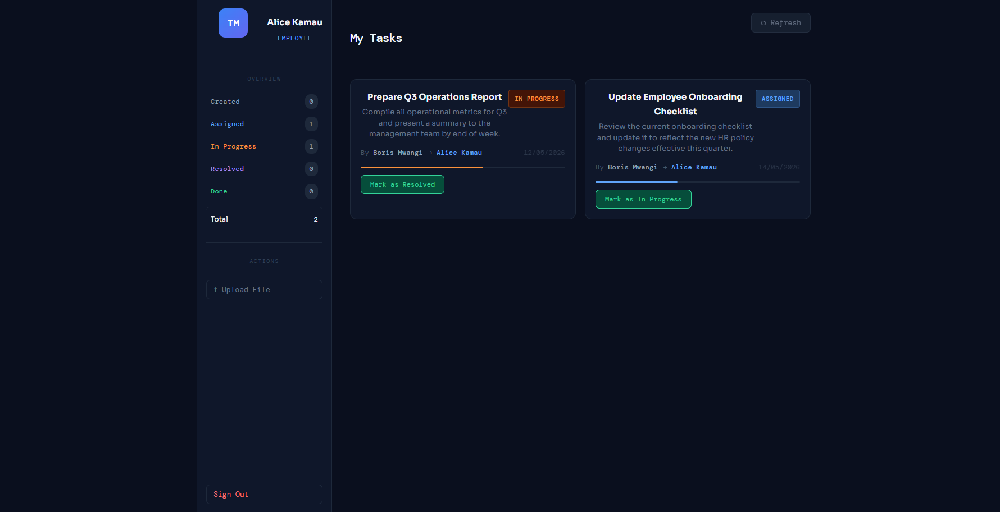
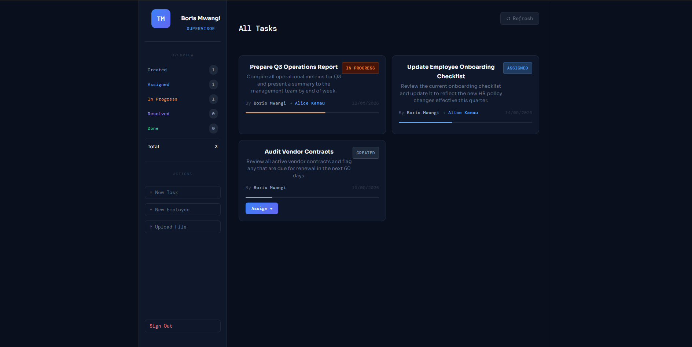

# TaskFlow — Task Management System

A collaborative task management application built with Spring Boot and React.

---

## Demo Accounts

The application automatically seeds these accounts and sample tasks on first startup. No manual setup needed.

| Role       | Email                  | Password        |
|------------|------------------------|-----------------|
| Supervisor | `boris@taskflow.com`   | `supervisor123` |
| Employee   | `alice@taskflow.com`   | `employee123`   |

### What's pre-loaded

- **Boris (Supervisor)** has created 3 tasks
- **Alice (Employee)** has 2 tasks assigned to her:
    - *Prepare Q3 Operations Report* — currently **In Progress**
    - *Update Employee Onboarding Checklist* — currently **Assigned**
- A third task (*Audit Vendor Contracts*) is unassigned and waiting in **Created** state

---

## Prerequisites

- Java 17+
- Node.js 18+
- PostgreSQL 14+ running locally

---

## Setup

### 1. Create the database

```sql
CREATE DATABASE taskflow;
```

### 2. Configure the backend

Open `src/main/resources/application.properties` and set your database credentials:

```properties
spring.datasource.url=jdbc:postgresql://localhost:5432/taskflow
spring.datasource.username=postgres
spring.datasource.password=your_password
```

### 3. Start the backend

```bash
./mvnw spring-boot:run
```

The API starts on **http://localhost:8080**.
Demo accounts and sample tasks are created automatically on first run.

### 4. Start the frontend

```bash
cd task-ui
npm install
npm run dev
```

The UI opens on **http://localhost:5173**.

---

## Usage

### Supervisor (Boris)
- Log in at `http://localhost:5173`
- Create new tasks with **+ New Task**
- Add employees with **+ New Employee**
- Assign created tasks to employees using the **Assign →** button on each task card
- Review resolved tasks and confirm them as **Done**

### Employee (Alice)
- Log in with the employee account
- View only tasks assigned to you
- Advance tasks through the workflow:
    - **Assigned → In Progress → Resolved**

---

## Task Workflow

```
CREATED → ASSIGNED → IN_PROGRESS → RESOLVED → DONE
```

| Transition            | Who can trigger |
|-----------------------|-----------------|
| CREATED → ASSIGNED    | Supervisor      |
| ASSIGNED → IN_PROGRESS| Employee        |
| IN_PROGRESS → RESOLVED| Employee        |
| RESOLVED → DONE       | Supervisor      |

---

## API Documentation

Swagger UI is available at:

```
http://localhost:8080/swagger-ui.html
```

To test authenticated endpoints:
1. Call `POST /api/auth/login` with your credentials
2. Copy the `token` from the response
3. Click **Authorize 🔒** in Swagger UI and paste the token

---

## Project Structure

```
├── src/main/java/com/taskmanagement/technicalinterview/
│   ├── config/
│   │   ├── security/          # JWT filter, service, Spring Security config
│   │   └── SwaggerConfig.java
│   ├── controller/            # REST endpoints (Auth, Task, User, File)
│   ├── dto/                   # Request/response objects
│   ├── enums/                 # Role, TaskStatus
│   ├── models/                # JPA entities (User, Task, TaskHistory, Attachment)
│   ├── repository/            # Spring Data JPA repositories
│   ├── service/               # Business logic
│   └── DataSeeder.java        # Auto-seeds demo data on first startup
└── task-ui/                   # React + Vite frontend
```

---


## Tech Stack

| Layer    | Technology                              |
|----------|-----------------------------------------|
| Backend  | Spring Boot 3, Spring Security, JWT     |
| Database | PostgreSQL                              |
| ORM      | Spring Data JPA / Hibernate             |
| Docs     | SpringDoc OpenAPI (Swagger UI)          |
| Frontend | React 18, Vite                          |
| Auth     | JWT Bearer tokens (24h expiry)          |
|          |                                         |

## Screen Shots

